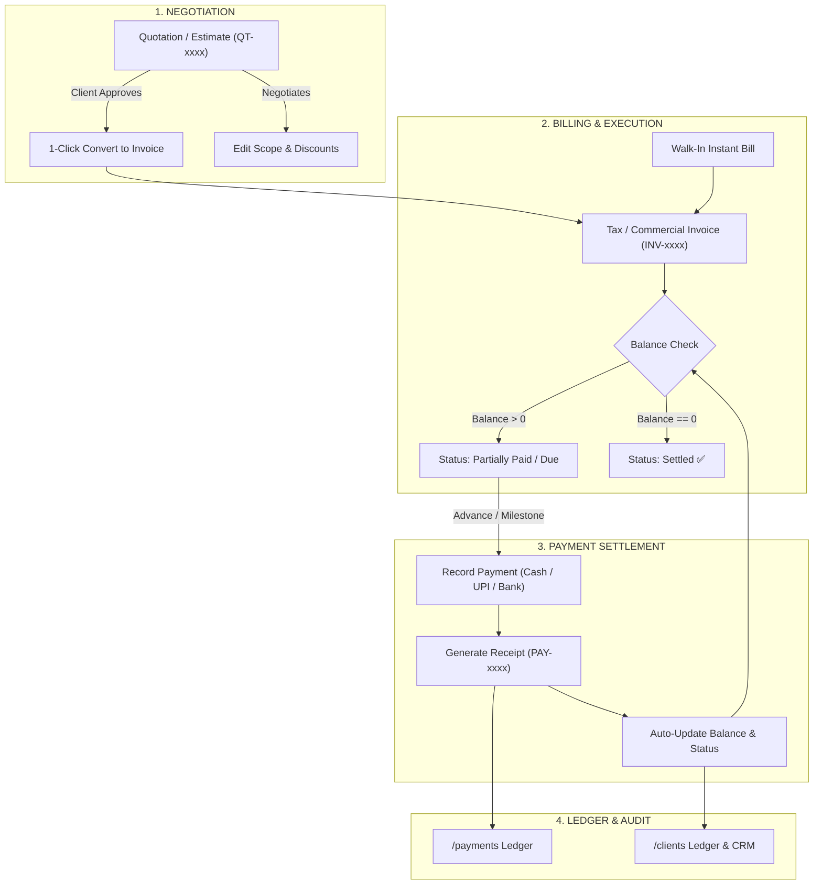

# BillEase — Modern Multi-Tenant Billing & Invoicing Platform

[](https://nextjs.org/)
[](https://www.typescriptlang.org/)
[](https://tailwindcss.com/)
[](https://supabase.com/)
[](https://vercel.com/)
[]()

**BillEase** is an enterprise-grade, multi-tenant billing, quotation, invoice, and financial ledger platform engineered specifically for **Event Planners, Print Studios, Graphic Designers, and Rental Services**.

Built with Next.js 15 App Router, React 19, and Supabase PostgreSQL, it pairs a bespoke **Tactile Neo-Claymorphism** visual design with strict deterministic accounting principles.

---

## 🌟 Key Capabilities & Modules

### 📊 1. Executive Dashboard (`/dashboard`)
* Real-time metrics tracking Gross Billed Volume, Collections, and Outstanding Receivables.
* **Payment Attention Radar**: Automatically highlights overdue accounts.
* **1-Click WhatsApp Follow-ups**: Dispatch pre-filled payment reminders directly to client phones.

### 👥 2. Clients CRM & Directory (`/clients`)
* Comprehensive customer profiles with optional GSTIN validation and lifetime financial ledgers.
* Direct action bar: **Call `[ 📞 ]`**, **WhatsApp `[ 💬 ]`**, and **Red Claymorphic Delete `[ 🗑️ ]`**.
* Instant filtering by financial status (`All Clients`, `With Balance Due`, `Settled`).

### 📦 3. Pricing & Services Catalog (`/services`)
* Multi-category catalog covering **Events & Rentals**, **Printing & Signage**, and **Design Services**.
* **Dynamic Creatables**: Add custom categories and custom units (e.g. `Sq Ft`, `Sets`, `1000 Pcs`) on-the-fly.

### 📄 4. Quotations & Estimates Engine (`/quotations`)
* Flexible line-item builder supporting package lump-sums or detailed Unit × Quantity calculations.
* Optional GST/Tax toggles and percentage/fixed discount engine.
* **1-Click "Convert to Invoice"**: Instantly transforms accepted estimates into official tax invoices.

### 🧾 5. Invoices & Billing (`/invoices`)
* Clear 3-part financial transparency strip: **Total Billed** | **Paid Amount** | **Balance Due**.
* Automatic status machine: `Unpaid` ➔ `Partially Paid` ➔ `Paid / Settled` ➔ `Overdue`.
* Walk-in customer mode for 15-second instant counter billing.

### 💳 6. Payments & Receipts Ledger (`/payments`)
* Complete audit ledger of all cash receipts, UPI transfers, and bank deposits.
* Quick-fill percentage helper chips (`20% Token`, `50% Advance`, `Full Balance Due`).
* Automatic invoice balance recalculation and client ledger synchronization upon payment logging.

### 📈 7. Executive Analytics & Reports (`/reports`)
* Timeframe filtering (`This Month`, `This Quarter`, `FY 2026-27`).
* Month-over-month Cash Flow dual-bar visualizations and revenue stream breakdown.
* Top 5 client ranking by lifetime valuation.

### ⚙️ 8. Business Settings & UPI QR (`/settings`)
* 2-column control center with custom document numbering sequences (`QT-`, `INV-`, `RCP-`).
* **Live UPI QR Code Preview**: Generates dynamic QR codes printed directly on customer invoices.
* Customizable WhatsApp message reminder templates with dynamic interpolation tags.

---

## 🏗️ Architecture & Data Flow



---

## 🛠️ Technology Stack

| Layer | Technology | Purpose |
| :--- | :--- | :--- |
| **Framework** | Next.js 15 (App Router) + React 19 | Server-side rendering, route handlers & streaming |
| **Language** | TypeScript 5 | Strict end-to-end type safety |
| **Styling** | Tailwind CSS + Custom CSS Variables | Utility styling & design tokens |
| **UI Design** | Tactile Neo-Claymorphism | Physical press physics & dual-layer depth shadows |
| **Icons** | Lucide React | Modern iconography system |
| **Database** | PostgreSQL via Supabase Cloud | ACID-compliant relational transactions & storage |
| **SDK** | `@supabase/supabase-js` + `@supabase/ssr` | Real-time database queries & session management |
| **Hosting** | Vercel Edge Network | Global serverless deployment with automated CI/CD |

---

## 📁 Repository Structure

```text
├── docs/                           # Architecture, business flows & roadmaps
│   ├── sales_and_billing_lifecycle.md
│   └── production_roadmap_and_pending_tasks.md
├── supabase/                       # Database migrations & schemas
│   └── schema.sql
├── src/
│   ├── app/                        # Next.js App Router (Routes & Layouts)
│   │   ├── (auth)/                 # Login, Signup, Password Reset
│   │   ├── (dashboard)/            # Dashboard, Clients, Services, Quotations, Invoices, Payments, Reports, Settings
│   │   ├── api/                    # REST / Webhook route handlers
│   │   ├── globals.css             # Neo-Claymorphism CSS tokens & utilities
│   │   └── layout.tsx
│   ├── components/                 # Reusable UI primitives & Domain components
│   │   ├── ui/                     # Buttons, Inputs, Cards, Badges, Modals
│   │   ├── layout/                 # Sidebar, Header, User Navigation
│   │   └── dashboard/              # Metrics, Cash Flow Charts, Payment Attention
│   ├── config/                     # Application & document configuration presets
│   ├── hooks/                      # Custom React hooks (Quotations, Invoices, Tenant)
│   ├── lib/                        # Formatting, currency, calculation helpers, Supabase client
│   │   └── supabase/
│   ├── mock/                       # Initial datasets & seed fallback fixtures
│   ├── services/                   # Database CRUD service repositories
│   │   ├── client.service.ts
│   │   ├── service.service.ts
│   │   ├── quotation.service.ts
│   │   ├── invoice.service.ts
│   │   └── payment.service.ts
│   └── types/                      # TypeScript domain models & interfaces
└── package.json
```

---

## 🚀 Getting Started Locally

### 1. Clone & Install Dependencies
```bash
git clone https://github.com/pramodDas-19/BillEase.git
cd BillEase
npm install
```

### 2. Configure Environment Variables
Create a `.env.local` file in the root directory:
```env
NEXT_PUBLIC_SUPABASE_URL=your_supabase_project_url
NEXT_PUBLIC_SUPABASE_ANON_KEY=your_supabase_anon_key
SUPABASE_SERVICE_ROLE_KEY=your_supabase_service_role_key
```

### 3. Initialize Database Schema
1. Open your Supabase SQL Editor.
2. Paste and run the contents of [`supabase/schema.sql`](supabase/schema.sql) to create all required tables and indexes.

### 4. Run Development Server
```bash
npm run dev
```

Open [http://localhost:3000](http://localhost:3000) in your browser.

---

## 🌐 Production Deployment (Vercel)

This repository is optimized for one-click deployment on **Vercel**:

1. Push your repository to GitHub.
2. Import the project on [Vercel](https://vercel.com).
3. Add the 3 Supabase environment variables (`NEXT_PUBLIC_SUPABASE_URL`, `NEXT_PUBLIC_SUPABASE_ANON_KEY`, `SUPABASE_SERVICE_ROLE_KEY`) in the Vercel project settings.
4. Click **Deploy**.

---

## 📄 License & Proprietary Notice

Copyright © 2026 BillEase. All rights reserved. Proprietary software.
