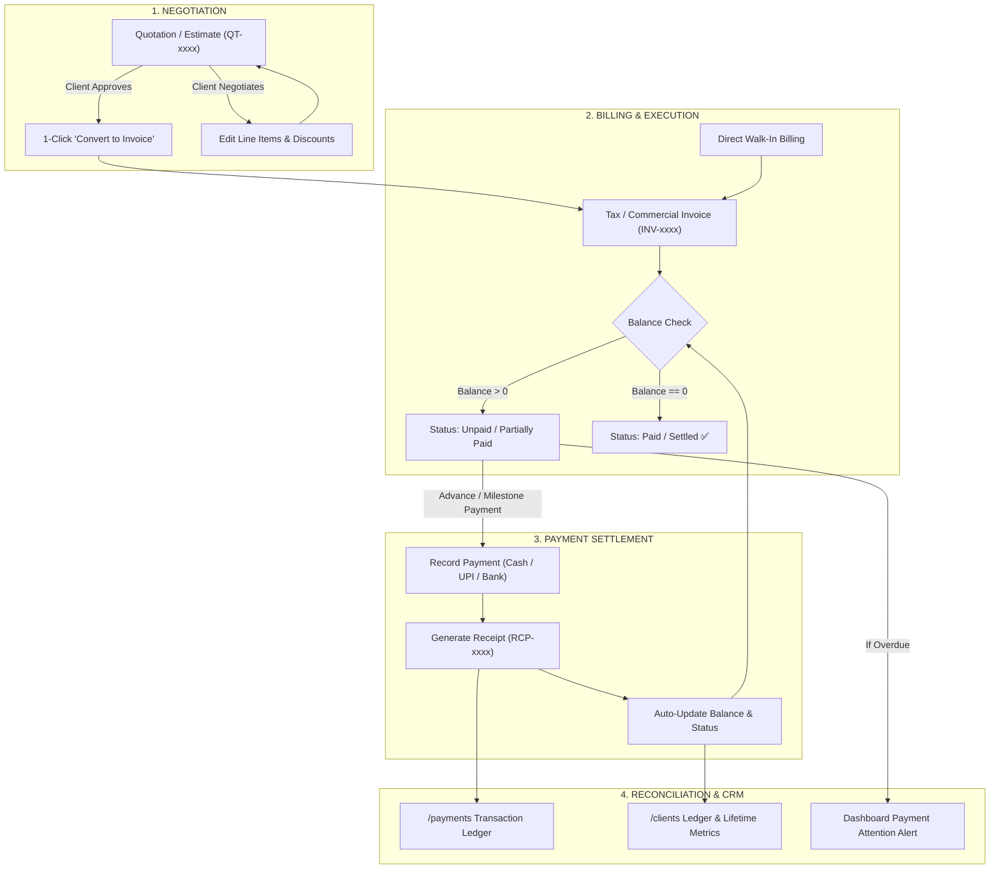

# BillEase — Sales & Billing Lifecycle Specification

---

## 1. Executive Summary & Flow Diagram

The **Sales & Billing Lifecycle** in BillEase is designed for high flexibility, zero double-data-entry, and support for real-world SMB workflows (Event Management, Print Studios, Graphic Designers, and Rental Services).



---

## 2. Core Mathematical Calculation Rules

Every invoice in the platform computes balances in real time using the following deterministic formula:

$$\mathbf{\text{Subtotal}} = \sum (\text{Line Item Amount})$$

$$\mathbf{\text{Discount Amount}} = \begin{cases} \text{Discount Value}, & \text{if Fixed (₹)} \\ \text{Subtotal} \times \frac{\text{Discount Value}}{100}, & \text{if Percentage (\%)} \end{cases}$$

$$\mathbf{\text{Taxable Amount}} = \text{Subtotal} - \text{Discount Amount}$$

$$\mathbf{\text{Total Tax}} = \begin{cases} \text{Taxable Amount} \times \frac{\text{GST Rate}}{100}, & \text{if Tax Enabled} \\ 0, & \text{if Tax Disabled} \end{cases}$$

$$\mathbf{\text{Total Invoice Amount}} = \text{Taxable Amount} + \text{Total Tax}$$

$$\mathbf{\text{Total Paid}} = \sum (\text{All Linked Payment Receipts})$$

$$\mathbf{\text{Balance Due}} = \max(0, \text{Total Invoice Amount} - \text{Total Paid})$$

### Automated Status Logic:
- **`Unpaid`**: $\text{Total Paid} = 0 \text{ and } \text{Balance Due} > 0$
- **`Partially Paid`**: $0 < \text{Total Paid} < \text{Total Invoice Amount}$
- **`Paid / Settled`**: $\text{Balance Due} = 0$
- **`Overdue`**: $\text{Balance Due} > 0 \text{ and Current Date } > \text{Due Date}$

---

## 3. Cash vs. UPI vs. Payment Gateway Handling

### Mode A: Manual Cash / Direct Personal UPI / Bank Transfer
1. **The Event**: A customer hands physical cash (`₹50,000`) or transfers to the owner's personal GPay/PhonePe number.
2. **Action**: The business owner clicks **`+ Record Payment`** on the invoice:
   - Selects Mode: `Cash` or `UPI / Google Pay` or `Bank Transfer (NEFT/RTGS)`.
   - Enters Amount: `₹50,000`.
   - Optional Reference / UTR: `UPI-982348923`.
   - Clicks **Save**.
3. **Automated Ripple Effects**:
   - Invoice balance drops by `₹50,000`.
   - Invoice status changes instantly (`Partially Paid` or `Paid`).
   - A numbered Payment Receipt (`RCP-xxxx`) is added to `/payments`.
   - Client's outstanding balance updates in `/clients`.
   - Removed from Dashboard Payment Attention if balance reaches `₹0`.

### Mode B: Automated Payment Gateway (Razorpay / Cashfree Dynamic QR)
1. **The Event**: Invoice PDF / WhatsApp message contains a dynamic UPI QR Code or "Pay Now" link.
2. **Action**: Customer scans and pays via any UPI app.
3. **Automated Ripple Effects**: Gateway sends an instant Webhook callback to the software. The system marks the invoice as **Paid** with **zero human intervention**.

---

## 4. Master Guide: 8 Real-World Business Scenarios

### Scenario 1: Standard Full-Lifecycle Project
- **Workflow**: Quote (`₹1,00,000`) ➔ Client Approves ➔ Convert to Invoice ➔ Client pays `₹40,000` Advance (Status: `Partially Paid`) ➔ Event Executed ➔ Client pays `₹60,000` Balance (Status: `Paid ✅`).
- **Ledger Result**: Invoice linked to 2 receipts (`RCP-101` and `RCP-102`), Balance = `₹0`.

### Scenario 2: Quick Walk-in Customer (No Quotation Needed)
- **Workflow**: Customer walks into print shop for 5 banners (`₹2,500`).
- **Action**: Click `+ New Invoice`, add line items, check *"Mark as Fully Paid on Creation"*, select `GPay/Cash`.
- **Duration**: **15 seconds**. Invoice and payment receipt generated simultaneously.

### Scenario 3: Scope / Price Negotiation Pre-Approval
- **Workflow**: Quote sent for `₹85,000`. Client asks to remove drone coverage and apply 5% discount.
- **Action**: Open Quote ➔ Click `Edit Quote` ➔ Remove line item ➔ Apply 5% discount ➔ Re-share updated PDF on WhatsApp with 1 click.

### Scenario 4: Multiple Unequal Milestone Payments
- **Workflow**: `₹3,00,000` large wedding decor job paid in 3 parts:
  - *Payment 1 (10 Aug)*: `₹30,000` (10% Token) ➔ Due: `₹2,70,000`
  - *Payment 2 (20 Aug)*: `₹1,20,000` (40% Material Advance) ➔ Due: `₹1,50,000`
  - *Payment 3 (30 Aug)*: `₹1,50,000` (50% Handover Settlement) ➔ Due: `₹0 (Settled ✅)`
- **Ledger Result**: Invoice maintains a transparent audit timeline showing all 3 payments with dates and payment modes.

### Scenario 5: Scope Expansion Mid-Project
- **Workflow**: Client requests 2 additional LED screens (`+₹25,000`) during live event execution.
- **Handling**: Click `Edit Invoice` to append new line items (Total adjusts from `₹1,00,000` ➔ `₹1,25,000` and Balance Due increments by `₹25,000`), OR issue a clean Supplementary Invoice `INV-1025` for `₹25,000`.

### Scenario 6: Cancellation & Partial Advance Refund
- **Workflow**: Client paid `₹50,000` advance on a `₹1,50,000` event, but cancels. Business policy retains `₹25,000` cancellation fee and refunds `₹25,000`.
- **Handling**: Invoice is marked `Cancelled / Adjusted`, and a negative refund adjustment receipt (`-₹25,000`) is logged, ensuring monthly accounting reflects exact net cash retained.

### Scenario 7: Overdue Follow-Up & Defaulting Account
- **Workflow**: Client balance of `₹40,000` is 5 days overdue.
- **Handling**: Dashboard flags client under **Payment Attention**. Owner uses the green **Direct Call `[ 📞 ]`** button or the amber **`[ 🔔 Send Reminder ]`** button to dispatch a personalized WhatsApp reminder in 1 click.

### Scenario 8: Rounding & Excess Settlement
- **Workflow**: Bill is `₹14,950`. Client transfers `₹15,000` on UPI.
- **Handling**: System allows single-click round-off adjustment or records `₹50` as client advance credit balance for future billing.

---

## 5. System Linking Architecture

```
┌────────────────────────────────────────────────────────┐
│                   CLIENT (Rahul Sharma)                │
│  - Total Lifetime Billed: ₹2,20,000                    │
│  - Total Collected: ₹160,000                           │
│  - Current Balance Due: ₹60,000                        │
└──────────────────────────┬─────────────────────────────┘
                           │
             ┌─────────────┴─────────────┐
             ▼                           ▼
  ┌───────────────────────┐   ┌──────────────────────────┐
  │  QUOTATION: QT-1045   │   │    INVOICE: INV-1024     │
  │  - Amount: ₹1,35,700  │   │  - Amount: ₹1,35,700     │
  │  - Status: Converted  │   │  - Status: Partially Paid│
  │  - Origin of INV-1024 │   │  - Origin: From QT-1045  │
  └───────────────────────┘   └────────────┬─────────────┘
                                           │
                            ┌──────────────┴─────────────┐
                            ▼                            ▼
                 ┌────────────────────┐       ┌────────────────────┐
                 │  RECEIPT: RCP-101  │       │  RECEIPT: RCP-102  │
                 │  - Amount: ₹50,000 │       │  - Amount: ₹25,700 │
                 │  - Mode: Bank NEFT │       │  - Mode: GPay UPI  │
                 │  - Date: 20 Aug    │       │  - Date: 28 Aug    │
                 └────────────────────┘       └────────────────────┘
```

---
*Document Version: 1.0 • Built for BillEase Multi-Tenant SaaS*
